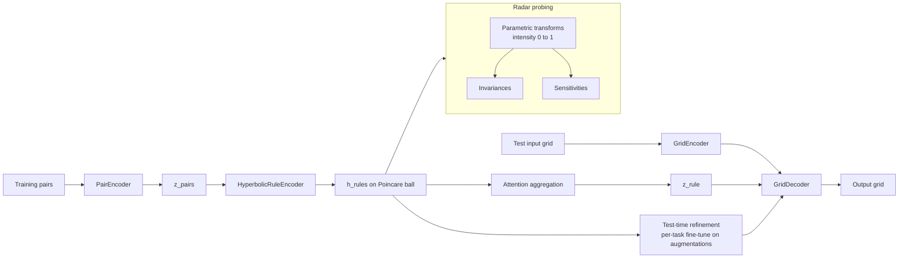

# arc-prize

[](https://github.com/ahb-sjsu/arc-prize/actions/workflows/ci.yml)
[](https://pypi.org/project/arc-prize/)
[](https://pypi.org/project/arc-prize/)
[](LICENSE)
[](https://github.com/astral-sh/ruff)

ARC-AGI-2 solver using geometric embeddings, hyperbolic rule inference, and adversarial structure probing.

## The ARC-AGI Challenge

The [Abstraction and Reasoning Corpus](https://arcprize.org/) (ARC) is a benchmark designed to measure general intelligence in AI systems. Each task presents a few input-output grid pairs that demonstrate an abstract transformation rule, and the solver must infer the rule and apply it to unseen test inputs.

**Why it matters:** Unlike language or vision benchmarks where scale and memorization dominate, ARC requires genuine program synthesis from minimal examples. No task appears twice, and the rules span spatial reasoning, counting, symmetry, object manipulation, and compositional logic.

| Milestone | Score | Notes |
|---|---|---|
| Human performance | ~98% | Median across crowd-sourced evaluations |
| ARC-AGI-2 Grand Prize | 85% | **$700,000** — unclaimed as of March 2026 |
| Current SOTA (unconstrained) | ~54% | Heavily ensembled LLM + search approaches |
| Current SOTA (Kaggle) | ~24% | Under compute/time constraints |

The Grand Prize requires 85% on the private ARC-AGI-2 evaluation set within a 12-hour Kaggle runtime budget. This repo implements a solver designed for that constraint.

## Approach

This solver combines three key ideas:

1. **Hyperbolic Rule Encoding** — ARC transformation rules are hierarchical (e.g., "tile the pattern" contains "repeat", "mirror", "offset"). The Poincare ball naturally represents this hierarchy: general rules near the origin, specific sub-rules near the boundary.

2. **Radar-like Structure Probing** — Parametric transforms at controllable intensity [0,1] are applied to grids and the model's latent response is measured. Transforms the model is *invariant* to reveal learned symmetries; transforms it's *sensitive* to reveal structural features it uses. This is adapted from the [Bond Index](https://github.com/ahb-sjsu/erisml-lib) adversarial fuzzing framework.

3. **Test-Time Refinement** — Per-task fine-tuning on augmented training pairs (the dominant winning pattern from ARC Prize 2025). Leave-one-out training on dihedral augmentations provides more signal per task.

## Architecture



The adversarial training component (gradient reversal) forces the encoder to be invariant to surface features (color palette, position) while remaining sensitive to structural features (pattern, symmetry, count).

## Installation

```bash
pip install arc-prize
```

Or for development:

```bash
git clone https://github.com/ahb-sjsu/arc-prize.git
cd arc-prize
pip install -e ".[dev]"
```

## Quick Start

```python
from arc_prize.solver import ARCSolver, SolverConfig
from arc_prize.data import load_arckit_tasks

# Load ARC-AGI-1 tasks
train_tasks, eval_tasks = load_arckit_tasks()

# Initialize solver
solver = ARCSolver(SolverConfig(device="cuda"))

# Solve a task
task = eval_tasks[0]
train_pairs = [(p.input, p.output) for p in task.train]
test_inputs = [p.input for p in task.test]

predictions = solver.solve_task(train_pairs, test_inputs, refine=True)
# predictions[i] = [candidate_1, candidate_2] for test input i
```

## Structure Probing

The radar-like probe system reveals what the model has learned:

```python
from arc_prize.fuzzer import StructureProbe, make_transform_suite
from arc_prize.encoder import GridEncoder

encoder = GridEncoder(z_dim=128)
probe = StructureProbe(encoder, transforms=make_transform_suite())

report = probe.scan(task_id="abc123", grid=input_grid, device="cuda")

# What is the model invariant to?
print(report.invariance_profile)
# {'color_permute': 0.95, 'rotate': 0.88, 'add_noise': 0.12, ...}

# How well does it separate structure from surface?
print(f"Robustness Index: {report.robustness_index:.3f}")
```

## Modules

| Module | Description |
|---|---|
| `grid.py` | Grid-tensor conversion, padding, object extraction |
| `encoder.py` | CNN + attention pooling grid encoder, pair encoder |
| `geometric.py` | Poincare ball operations, hyperbolic rule encoder |
| `decoder.py` | FiLM-conditioned CNN grid decoder |
| `fuzzer.py` | Parametric structure probing (the "radar") |
| `adversarial.py` | Gradient reversal for surface-invariant encoding |
| `augment.py` | Dihedral group + color permutation augmentations |
| `solver.py` | End-to-end solver with test-time refinement |
| `data.py` | Task loading from JSON / arckit |
| `evaluate.py` | Exact-match scoring |
| `submit.py` | Kaggle submission generator |

## Development

```bash
# Lint
ruff check src/ tests/
ruff format src/ tests/

# Test
pytest

# Test with coverage
pytest --cov=arc_prize --cov-report=term-missing
```

## License

MIT
